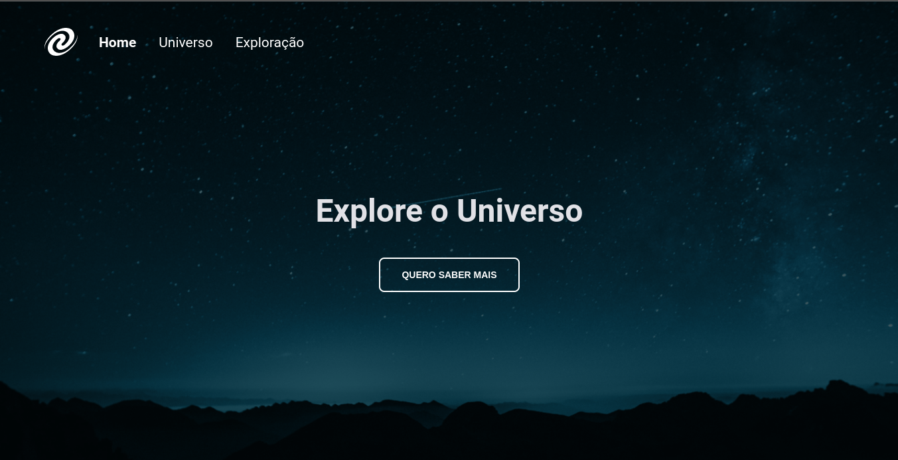

# Explorer Rocketseat

> Modulo 06 Stage 06

Projeto SPA Universe, projeto construido no modulo stage 06 do Explorer programa de ensino,
da Rocketseat para quem busca sua primeira vaga de front-end developer. O projeto foi desenvolvido como uma atividade para estudar como funciona as Single Page Aplication SPA

[🔗 Clique aqui para acessar](https://kellyrrmartins.github.io/kellyrrmartins.github.io/)

## 🛠️ Tecnologias

- HTML
- CSS
- Git e Github
- Conceitos de Single Page Aplication
